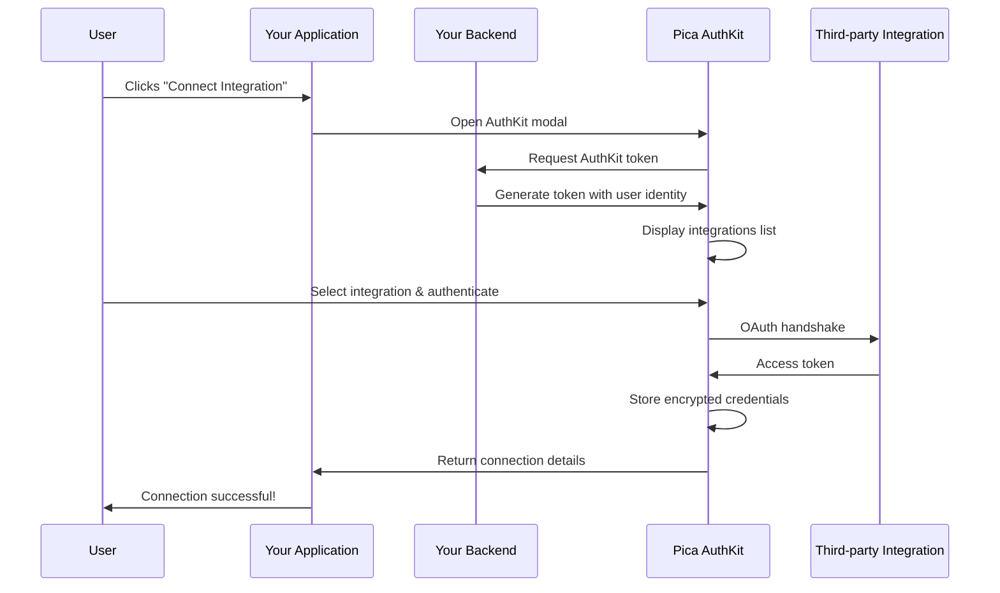

# AuthKit

[](https://npmjs.com/package/@picahq/authkit)

AuthKit is a pre-built, embeddable authentication UI that makes it easy for your users to securely connect their third-party accounts (Gmail, Slack, Salesforce, QuickBooks, etc.) directly within your application. Think of it as *"Plaid for integrations."*


Fully compatible with popular frameworks such as React, Next.js, Vue, Svelte, and more.

**Full documentation**: https://docs.picaos.com/authkit
**Setup guide**: https://docs.picaos.com/authkit/setup
**Manage AuthKit**: https://docs.picaos.com/authkit/management

**Demo project**: https://github.com/picahq/authkit-demo

## Install

With npm:

```jsx
npm i @picahq/authkit
```

With yarn:

```jsx
yarn add @picahq/authkit
```

## Using the AuthKit component

You'll want to replace the `token URL` with your token endpoint URL, which can be securely generated from your backend using Pica's AuthKit token generator package for the language you're using.

```jsx
import { useAuthKit } from "@picahq/authkit";

const { open } = useAuthKit({
  token: {
    url: "https://api.your-company-name.com/authkit-token",
    headers: {},
  },
  onSuccess: (connection) => {},
  onError: (error) => {},
  onClose: () => {},
});
```

## Backend Token Generation

To enable AuthKit connections, set up a backend endpoint that securely generates an AuthKit token for each authenticated user. For setup details and example code in multiple languages, see the [Backend Setup Guide](https://docs.picaos.com/authkit/setup#backend-setup).

**TypeScript**: https://npmjs.com/package/@picahq/authkit-token
**Python**: https://pypi.org/project/authkit-token

## Diagram



## Demo

You can see a demo of the AuthKit component in the [demo project](https://github.com/picahq/authkit-demo).

## License

This project is licensed under the GPL-3.0 license. See the [LICENSE](LICENSE) file for details.
